# Specification: `pdf-vdiff`

A fast, standalone Rust CLI tool that takes two PDF documents (e.g., a base resume and a tailored resume) and produces a single side-by-side landscape PDF with IntelliJ-style visual diff highlighting.

---

## 1. Overview & Problem Statement

When tailoring resumes, cover letters, or legal documents, users need to quickly inspect what content was added, removed, or reworded between versions. Existing tools either:
- Create an overlapping/blended color mask (e.g. `diff-pdf`), which is hard to read and loses vector crispness.
- Perform a terminal/text-only diff, losing layout, typography, and visual context.

`pdf-vdiff` solves this by:
1. Extracting text tokens and their exact bounding boxes from both PDFs using PDFium.
2. Normalizing page coordinate frames (CropBox, orientation) and clustering tokens into natural visual reading order.
3. Computing hierarchical line-level and token-level diffs using Myers / Sequence Matching algorithms.
4. Rendering a side-by-side landscape PDF where:
   - **Left Pane (Base)**: Highlights deleted/modified text in soft red.
   - **Right Pane (Tailored)**: Highlights added/modified text in soft green.
5. Preserving 100% vector fidelity and text searchability by embedding native page objects and rendering highlights as semi-transparent vector paths.

---

## 2. CLI Interface & UX

### 2.1 Invocation Syntax

```bash
pdf-vdiff [OPTIONS] <BASE_PDF> <TAILORED_PDF>
```

### 2.2 Arguments & Options

| Argument / Flag | Type | Default | Description |
| :--- | :--- | :--- | :--- |
| `<BASE_PDF>` | `PathBuf` (Required) | - | Path to the original / base PDF document. |
| `<TAILORED_PDF>` | `PathBuf` (Required) | - | Path to the modified / tailored PDF document. |
| `-o, --output <PATH>` | `Option<PathBuf>` | `<base_stem>_vs_<tailored_stem>_diff.pdf` | Target output PDF file path (resolves relative to current working directory). |
| `-f, --force` | `bool` | `false` | Overwrite destination output file if it already exists. |
| `--open` | `bool` | `false` | Automatically open the generated diff in the system default PDF viewer (e.g. macOS Preview). Non-fatal on headless CI. |
| `--theme <THEME>` | `Enum` | `intellij` | Color palette (`intellij`, `github`, `classic`, `high-contrast`). |
| `--granularity <MODE>` | `Enum` | `word` | Diff granularity (`word`, `line`, `character`). |
| `--gutter-width <PT>` | `f32` | `24.0` | Spacing in points between left and right pages. |
| `--no-header` | `bool` | `false` | Suppress the top header/metadata banner (`HeaderHeight = 0.0 pt`). |
| `--max-pages <NUM>` | `usize` | `250` | Maximum page count threshold to prevent unbounded processing. |
| `-v, --verbose` | `bool` | `false` | Enable verbose structural logging (omits sensitive raw text PII). |
| `-h, --help` | - | - | Print help information. |
| `-V, --version` | - | - | Print version information. |

### 2.3 Example CLI Workflow

```bash
# Compare base resume with tailored Google resume and open immediately
pdf-vdiff resume_base.pdf resume_google.pdf --open

# Custom output file, GitHub theme, and force overwrite
pdf-vdiff base.pdf tailored.pdf -o ./output/diff.pdf --theme github --force
```

### 2.4 Exit Codes

| Exit Code | Meaning | CLI Behavior |
| :---: | :--- | :--- |
| `0` | **Identical Documents** | No differences detected. Generates side-by-side diff PDF without highlights, prints informational notice to `stdout`, and exits successfully. |
| `1` | **Differences Found** | Differences detected. Generates side-by-side diff PDF with highlights and exits with code 1. |
| `2` | **Execution Error** | Fatal error (missing input file, output destination locked/exists without `--force`, password-protected PDF, image-only PDF with zero text layers, or malformed PDF). Emits error to `stderr`. |

---

## 3. Architecture & Data Flow

```mermaid
flowchart TD
    subgraph Ingestion ["1. Document Ingestion & Hardened Extraction"]
        A["Input PDFs (Base & Tailored)"] --> B["Pre-flight Path & Dimension Validation"]
        B --> C["PDFium Parser (V8 Scripts & Actions Disabled)"]
        C --> D["Extract Raw Text Tokens & CropBox-Normalized Bounding Boxes"]
    end

    subgraph Normalization ["2. Normalization & Spatial Clustering (Pure Rust)"]
        D --> E["Unicode NFKD Normalization & Ligature Decomposition"]
        E --> F["Spatial Column Clustering (X-Gap Histogram)"]
        F --> G["Baseline Line Grouping (Delta Y <= 2.0 pt) & Reading-Order Sort"]
    end

    subgraph DiffEngine ["3. Hierarchical Diff Engine (Pure Rust)"]
        G --> H["Pass 1: Coarse Visual Line Alignment (Myers / LCS)"]
        H --> I["Pass 2: Fine-Grained Token / Word Diff on Modified Lines"]
        I --> J["Contiguous Token Box Unioning & Diff IR Generation"]
    end

    subgraph Compositor ["4. Canvas Compositor & Vector Rendering"]
        J --> K["Calculate Canvas Dimensions (Top-Aligned Direct Below Header)"]
        K --> L["Layer 1: Background & Page-Mismatch Placeholders"]
        L --> M["Layer 2: Embed Vector Page Objects (Left & Right Viewports)"]
        M --> N["Layer 3: Draw Highlight Rectangles (Vector Paths, Alpha Fill, Multiply Blend)"]
        N --> O["Layer 4: Draw Gutter Line & Header Banner"]
    end

    subgraph Output ["5. Output & System Integration"]
        O --> P["Atomic File Write via Tempfile"]
        P --> Q["Optional Non-Fatal System Viewer Launch (--open)"]
        Q --> R["Return Exit Code (0 = Identical, 1 = Diff, 2 = Error)"]
    end
```



---

## 4. Technical Specifications

### 4.1 Crate Architecture & Dependencies

The project is structured as a dual-target crate:
- **`src/lib.rs` (`pdf_vdiff`)**: Pure-Rust core library containing geometry, tokenization, spatial clustering, sequence diffing, layout math, and theme definitions.
- **`src/main.rs` (`pdf-vdiff`)**: Thin CLI entrypoint orchestrating CLI parsing, PDFium FFI lifecycle, atomic IO, and exit codes.

```text
src/
├── lib.rs              # Public library interface (100% testable without FFI)
├── main.rs             # CLI binary entrypoint (clap, exit code orchestration)
├── cli.rs              # Clap CLI definitions and validation
├── error.rs            # Typed error definitions (thiserror enum PdfVdiffError)
├── model.rs            # TextToken, Rect, PageText, DiffOp, DiffDocument IR
├── cluster.rs          # Spatial column clustering and reading-order reconstruction
├── diff.rs             # Hierarchical Myers diffing and highlight merging
├── theme.rs            # Color palettes (IntelliJ, GitHub, Classic, High-Contrast)
├── layout.rs           # Coordinate transforms, header geometry, and pane origins
└── pdf/                # PDFium lifecycle, extraction adapter, and vector compositor
```

#### Dependencies (`Cargo.toml`)
* **`clap`** (v4, features = `["derive", "cargo"]`): CLI parsing and validation.
* **`pdfium-render`** (v0.9): Safe wrapper for PDFium text extraction and vector page compositing.
* **`similar`** (v2, features = `["unicode"]`): Fast Myers sequence matching and LCS algorithms.
* **`unicode-normalization`** (v0.1): NFKD normalization for robust ligature and character matching.
* **`open`** (v5): Cross-platform launcher for `--open`.
* **`thiserror`** (v1): Domain error definitions.
* **`anyhow`** (v1): Application error handling in CLI binary.
* **`tempfile`** (v3): Atomic file writing and test sandboxing.

#### Dev-Dependencies (`[dev-dependencies]`)
* **`assert_cmd`** (v2): CLI binary execution and exit code assertion.
* **`predicates`** (v3): CLI output assertions.

---

### 4.2 Data Models & Representation

```rust
/// Bounding box in PDF user-space points with bottom-left origin.
/// Invariant: x1 >= x0 and y1 >= y0.
#[derive(Debug, Clone, Copy, PartialEq)]
pub struct Rect {
    pub x0: f32, // Left
    pub y0: f32, // Bottom
    pub x1: f32, // Right
    pub y1: f32, // Top
}

impl Rect {
    pub fn new(x0: f32, y0: f32, x1: f32, y1: f32) -> Self {
        Self { x0, y0, x1, y1 }
    }
    
    pub fn union(&self, other: &Rect) -> Rect {
        Rect {
            x0: self.x0.min(other.x0),
            y0: self.y0.min(other.y0),
            x1: self.x1.max(other.x1),
            y1: self.y1.max(other.y1),
        }
    }
}

/// Extracted text token with geometric and structural metadata.
/// Note: `normalized_text` (NFKD) can be computed lazily or as a transient diff key to minimize memory.
#[derive(Debug, Clone, PartialEq)]
pub struct TextToken {
    pub text: String,
    pub normalized_text: String, // NFKD normalized for diffing
    pub bounds: Rect,            // CropBox-normalized PDF user points
    pub page_index: usize,       // 0-indexed page
    pub column_index: usize,     // Spatial column index
    pub line_index: usize,       // Visual line index
    pub trailing_space: bool,
}

/// Diff operation category.
#[derive(Debug, Clone, Copy, PartialEq, Eq)]
pub enum DiffOpKind {
    Equal,
    Delete,
    Insert,
    Replace,
}

/// Highlight segment to be rendered on the composite canvas.
#[derive(Debug, Clone, PartialEq)]
pub struct HighlightSpan {
    pub bounds: Rect,
    pub op: DiffOpKind,
    pub is_modified_token: bool, // True for specific altered words in a replaced line
}
```

---

### 4.3 Domain Error Enum (`src/error.rs`)

```rust
#[derive(thiserror::Error, Debug)]
pub enum PdfVdiffError {
    #[error("File not found: {0}")]
    FileNotFound(std::path::PathBuf),

    #[error("Output file '{0}' already exists. Use --force to overwrite.")]
    OutputFileExists(std::path::PathBuf),

    #[error("Failed to open PDF at '{path}': {reason}")]
    PdfOpen { path: std::path::PathBuf, reason: String },

    #[error("PDF '{0}' is password-protected. Please provide an unlocked document.")]
    PasswordProtected(std::path::PathBuf),

    #[error("PDF '{0}' contains no extractable text layer. Text-based diffing requires OCR text.")]
    NoTextLayer(std::path::PathBuf),

    #[error("Page count ({0}) exceeds maximum allowed limit ({1}). Override with --max-pages.")]
    PageCountExceeded(usize, usize),

    #[error("Invalid page dimensions in '{path}': {reason}")]
    InvalidDimensions { path: std::path::PathBuf, reason: String },

    #[error("Output IO error at '{path}': {source}")]
    OutputIo { path: std::path::PathBuf, source: std::io::Error },

    #[error("Rendering engine error: {0}")]
    Render(String),
}
```

---

### 4.4 Extraction, Coordinate Normalization & Spatial Clustering

1. **Coordinate Frame & CropBox Normalization**:
   - Extract `CropBox` origin $(x_{cb}, y_{cb})$.
   - Transform all raw token bounds: $x_{rel} = x - x_{cb}$, $y_{rel} = y - y_{cb}$.
   - For rotated pages ($90^\circ, 180^\circ, 270^\circ$), normalize page dimensions and bounds to upright ($0^\circ$) coordinates.
2. **Text Normalization**:
   - Apply Unicode NFKD normalization to decompose ligatures (`fi` $\to$ `fi`, `fl` $\to$ `fl`) and normalize typographical quotes/dashes for accurate diff matching while preserving original glyph visual bounds.
3. **Spatial Column Clustering ($O(T \log T)$)**:
   - Calculate horizontal $X$-projection gap histograms across the page width.
   - Detect vertical gutters (gaps $> 12.0\text{ pt}$, empirically chosen for standard 2-column resume margins $\ge 1/6$ inch while avoiding intra-line word gaps) to partition tokens into columns (`column_index`). Tunable via internal constant `DEFAULT_COLUMN_GUTTER_THRESHOLD`.
4. **Visual Baseline Line Grouping**:
   - Within each column, group tokens into lines using baseline vertical tolerance ($\Delta y \le 2.0\text{ pt}$, approximately $1/5$ of standard $10\text{--}12\text{ pt}$ body font height to absorb sub-pixel PDF baseline floating-point jitter without conflating adjacent lines).
   - Sort columns left-to-right, lines top-to-bottom ($Y$ descending), and tokens left-to-right ($X$ ascending) to establish true reading order.

---

### 4.5 Token-Stream Diff Engine & Highlight Box Unioning

1. **Scope**: Diffing is performed per page-pair $(P_{base}[i], P_{tailored}[i])$ for $i \in 0 .. \max(N_{base}, N_{tailored})$. If $i \ge N_{base}$, the Base token slice is empty (`&[]`), marking all tokens on Tailored page $i$ as `Insert`.
2. **Token-Stream Sequence Matching (`word` / `character` mode)**:
   - Tokens in natural visual reading order are compared directly across the page stream using Myers sequence diffing.
   - Text that wraps or shifts across visual line boundaries due to insertions/deletions on preceding lines is recognized as identical (`DiffOp::Equal`) and produces zero highlight rectangles (reflow invariance).
   - Only genuinely inserted tokens (on tailored page) and deleted tokens (on base page) receive highlight rectangles.
3. **Line-Level Matching (`line` mode)**:
   - For `--granularity line`, normalized line strings are diffed using Myers sequence matching, highlighting full line bounding boxes.
4. **Contiguous Highlight Merging**:
   - Adjacent altered tokens on the same line are merged into a single contiguous bounding box:
     $$x_0 = \min(t.x_0) - \text{pad}_x,\quad y_0 = \min(t.y_0) - \text{pad}_y,\quad x_1 = \max(t.x_1) + \text{pad}_x,\quad y_1 = \max(t.y_1) + \text{pad}_y$$
   - Contiguous highlight bounding boxes are expanded using the padding constants defined in Section 4.6 (`HIGHLIGHT_PAD_X = 0.5 pt`, `HIGHLIGHT_PAD_Y = 1.0 pt`, `HIGHLIGHT_CORNER_RADIUS = 1.5 pt`).

---

### 4.6 Visual Styling & Complete Theme Palettes

#### Highlight Geometry & Padding Constants
- **`HIGHLIGHT_PAD_X: f32 = 0.5 pt`**: Horizontal breathing room to avoid hugging glyph edges.
- **`HIGHLIGHT_PAD_Y: f32 = 1.0 pt`**: Vertical padding ensuring ascenders and descenders are fully covered.
- **`HIGHLIGHT_CORNER_RADIUS: f32 = 1.5 pt`**: Rounded rectangle corner radius for soft, modern visual highlights.

#### Theme Color Palettes
All themes define RGBA colors for fills and strokes:

| Theme | Deletion Fill (Left Pane) | Deletion Stroke | Addition Fill (Right Pane) | Addition Stroke | Replaced Line Tint | Gutter / Divider |
| :--- | :--- | :--- | :--- | :--- | :--- | :--- |
| **`intellij`** (Default) | `rgba(255, 180, 180, 0.40)` | `rgb(229, 115, 115)` | `rgba(180, 235, 195, 0.40)` | `rgb(129, 199, 132)` | `rgba(255, 235, 150, 0.20)` | `rgb(220, 224, 230)` |
| **`github`** | `rgba(255, 205, 210, 0.45)` | `rgb(215, 58, 73)` | `rgba(200, 240, 205, 0.45)` | `rgb(40, 167, 69)` | `rgba(255, 245, 180, 0.25)` | `rgb(209, 213, 218)` |
| **`classic`** | `rgba(255, 128, 128, 0.50)` | `rgb(200, 0, 0)` | `rgba(128, 230, 128, 0.50)` | `rgb(0, 160, 0)` | `rgba(255, 255, 140, 0.30)` | `rgb(180, 180, 180)` |
| **`high-contrast`** | `rgba(255, 90, 90, 0.70)` | `rgb(180, 0, 0)` | `rgba(80, 220, 80, 0.70)` | `rgb(0, 120, 0)` | `rgba(255, 240, 50, 0.45)` | `rgb(100, 100, 100)` |

#### Header Banner Styling
- **Default Height**: `DEFAULT_HEADER_HEIGHT: f32 = 36.0 pt` (set to `0.0 pt` if `--no-header` is active; provides 10 pt title font line height + 8 pt metadata font line height + 18 pt vertical padding for breathing room).
- **Background**: `rgb(245, 247, 250)`, bottom border line `0.75 pt` `rgb(215, 220, 228)`.
- **Typography**:
  - Title: 10 pt Helvetica Bold `rgb(33, 37, 41)` (left-aligned: `"Base: <base_name>  vs  Tailored: <tailored_name>"`).
  - Page & Status: 8 pt Helvetica Regular `rgb(108, 117, 125)` (right-aligned: `"Page N of M | <status>"` where $N = \text{page\_index} + 1$).

#### Page Mismatch Placeholder Styling
- **Background**: `rgb(250, 250, 252)`.
- **Border**: `1.0 pt` dashed line (`dash pattern: [4, 4]`) in `rgb(200, 204, 210)`.
- **Label**: Centered 12 pt Helvetica Italic `rgb(140, 145, 155)`: *"[No corresponding page in <Base/Tailored> Document]"*.

---

## 5. Page Layout & Canvas Composition

For each compared page pair $(P_{base}[i], P_{tailored}[i])$:

### 5.1 Dimension & Coordinate Transformation Formulas

1. **Total Canvas Dimensions**:
   $$W_{out} = W_{base} + W_{tailored} + \text{Gutter}$$
   $$H_{out} = \max(H_{base}, H_{tailored}) + H_{header}$$
2. **Pane Origins (PDF User Space, Bottom-Left Origin)**:
   - **Left Pane (Base)**: $(X_0, Y_0) = (0,\; \max(H_{base}, H_{tailored}) - H_{base})$
   - **Right Pane (Tailored)**: $(X_0, Y_0) = (W_{base} + \text{Gutter},\; \max(H_{base}, H_{tailored}) - H_{tailored})$
   - **Header Banner**: Spans $X \in [0, W_{out}]$, $Y \in [H_{out} - H_{header}, H_{out}]$.
   - **Top-Alignment Invariant**: Pages are top-aligned directly below the header banner, ensuring visual baseline continuity.
3. **Token Coordinate Transformation**:
   $$(x_{canvas}, y_{canvas}) = (X_0 + x_{token},\; Y_0 + y_{token})$$

### 5.2 4-Layer Z-Order Rendering Pipeline

1. **Layer 1 (Backgrounds & Placeholders)**: Render canvas background and any placeholder panels for mismatched pages.
2. **Layer 2 (Embedded Vector Content)**: Embed Base and Tailored pages as native vector XObjects onto Left and Right viewports.
3. **Layer 3 (Vector Highlight Paths)**: Draw highlight rectangles directly into page content streams as `PdfPagePathObject` with RGBA fills and `Multiply` blend mode.
4. **Layer 4 (Overlays & Chrome)**: Draw vertical gutter divider line and top header banner.

---

## 6. Security, Hardening & Privacy

1. **PDFium Attack Surface Hardening**:
   - Initialize PDFium with Google V8 JavaScript runtime, XFA forms, and dynamic action handlers completely disabled.
   - Reject external URI triggers or embedded executable launch actions.
2. **Atomic File Writes & Overwrite Protection**:
   - Write all generated output to a temporary file (`tempfile::NamedTempFile`) in the target directory.
   - Atomically persist/rename to destination only after generation succeeds.
   - If destination exists and `--force` is not supplied, abort immediately with exit code `2`.
3. **Resource Bounds & Dimension Sanitization**:
   - Enforce bounded page dimensions ($72.0\text{ pt} \le \dim \le 14,400.0\text{ pt}$). Reject `NaN`, negative, or non-finite values.
   - Enforce `--max-pages` (default 250) to prevent memory exhaustion on pathological PDFs.
4. **Privacy & PII Protection**:
   - Verbose logging (`-v`) logs structural metadata (page counts, token metrics, bounding boxes) but **never** dumps raw document text.
   - Sanitize output PDF metadata: do not embed absolute local host paths.
5. **Encrypted Documents**:
   - **User Password Encryption** (file payload encrypted): Terminates gracefully with exit code `2` prompting for unlocked documents.
   - **Owner / Permission Restrictions** (viewing permitted, printing/editing restricted): Accesses text streams for comparison normally without requiring owner password elevation.
6. **Non-Fatal System Viewer**:
   - If `--open` fails (headless CI runner, Docker container, missing default viewer), emit a non-fatal warning on `stderr` and retain the exit code (`0` or `1`).

---

## 7. Quality Assurance & Test Strategy

### 7.1 Test Coverage Target
* **Target**: Strict **85% minimum code coverage** enforced via `cargo llvm-cov --fail-under-lines 85`.
* Pure-Rust core library architecture (`src/lib.rs`) ensures that geometry, clustering, diffing, and formatting are 100% unit-testable without native FFI setup.

### 7.2 Test Suite Structure

```text
tests/
├── fixtures/
│   ├── identical/          # Minimal identical PDF pairs (< 15 KB)
│   ├── edits/              # Resumes with additions, deletions, replacements
│   ├── multicolumn/        # 2-column resume layout with out-of-order text streams
│   ├── pagemismatch/       # 1-page vs 2-page documents
│   ├── encrypted/          # Password-protected test PDF
│   ├── malformed/          # Empty file, corrupt header, truncated stream
│   └── scanned/            # Image-only PDF with 0 text tokens
├── unit/                   # Pure-Rust unit tests (clustering, diff, layout)
└── integration/            # CLI end-to-end integration tests (assert_cmd)
```

### 7.3 Programmatic Integration Assertions
* Validate generated diff PDFs using `pdfium-render` to assert:
  - Page count equals $\max(N_{base}, N_{tailored})$.
  - Dimensions match $W_{out} = W_b + W_t + \text{Gutter}$ and $H_{out} = \max(H_b, H_t) + H_{header}$.
  - Presence of vector path highlight objects on appropriate pages.
  - Correct exit codes (`0`, `1`, `2`) across all failure and success scenarios.

---

## 8. Finalized Architectural Decisions

1. **Test Coverage Minimum**: Strict **85% code coverage minimum** enforced via `cargo llvm-cov`.
2. **Dual-Mode PDFium Bundling**:
   - Development & Nix: Dynamic binding via `Pdfium::bind_to_system_library()`.
   - Release distribution: Static bundling (`features = ["static"]`) for self-contained, zero-dependency release binaries.
3. **Spatial Column Clustering**: $O(T \log T)$ horizontal gap histogram clustering to reconstruct natural reading order on multi-column resumes.
4. **Hierarchical 2-Pass Diffing**: Fast line-level LCS matching followed by token-level diffing on modified lines to eliminate $O(N^2)$ quadratic slowdowns.
5. **CLI Exit Code Contract**: Standard diff exit codes: `0` (Identical), `1` (Differences found), `2` (Execution error) as specified in [Section 2.4](file:///Users/meni/workspace/pdf-vdiff/specs/spec.md#24-exit-codes).
6. **Vector Path Highlighting**: Highlights rendered as native `PdfPagePathObject` vector rectangles with RGBA fills and `Multiply` blend mode, ensuring identical rendering across all PDF viewers.
